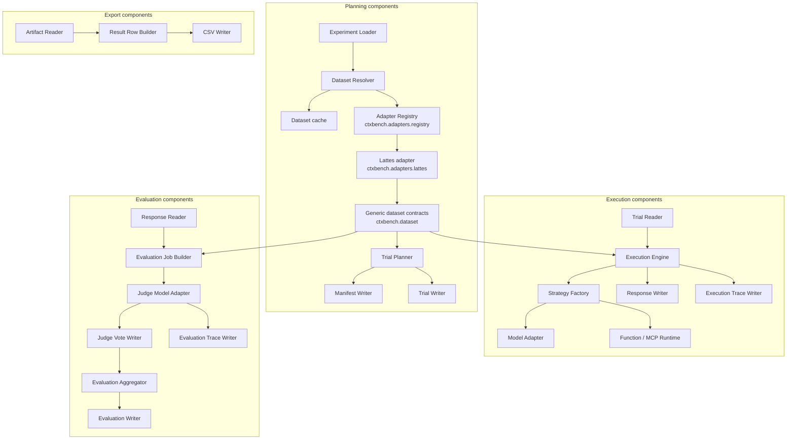

# C4 — Component Diagram

## Diagram



## Component notes

The components are implemented as Python modules. During migration, some implementation details may
still live behind compatibility adapters, but the target ownership is:

```text
ctxbench.cli
ctxbench.commands
ctxbench.benchmark
ctxbench.dataset
ctxbench.adapters.registry
ctxbench.adapters.lattes
ctxbench.ai
```

## Dataset and adapter components

`ctxbench.dataset` owns generic contracts, payloads, errors, capability reports, and adapter
registry primitives. It does not import concrete adapters.

`ctxbench.adapters.registry` owns first-party wiring. It registers dataset identities, such as
`ctxbench/lattes`, to factories that create concrete adapters from resolved dataset provenance.

`ctxbench.adapters.lattes` is a concrete first-party adapter. It may depend on `ctxbench.dataset`
contracts, but the benchmark core must not import it directly.

The intended dependency direction is:

```text
ctxbench.benchmark / ctxbench.commands -> ctxbench.dataset <- ctxbench.adapters.lattes
composition root -> ctxbench.adapters.registry
```
