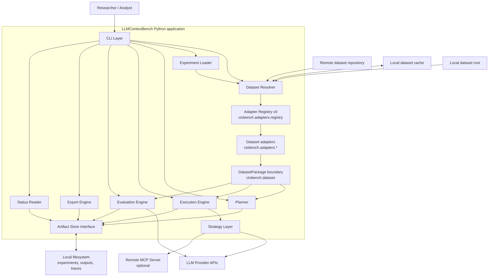

# C4 — Container Diagram

## Diagram

## Containers

| Container | Responsibility |
|---|---|
| CLI Layer | Parses commands and arguments. |
| Experiment Loader | Loads and validates experiment definitions. |
| Dataset Resolver | Resolves local dataset roots and cached `dataset.id@version` references without implicit network access. |
| Adapter Registry v0 | Composition point that maps dataset identity/provenance to a registered `DatasetPackage` adapter. |
| DatasetPackage boundary | Domain-neutral contract surface in `ctxbench.dataset` used by planning, execution, and evaluation. |
| Dataset adapters | Concrete first-party adapters such as `ctxbench.adapters.lattes`; concrete adapter classes are imported only by `ctxbench.adapters.registry`. |
| Planner | Generates `trials.jsonl` and `manifest.json`. |
| Execution Engine | Executes trials and writes responses/traces. |
| Strategy Layer | Implements context provisioning alternatives. |
| Evaluation Engine | Evaluates responses and writes eval artifacts. |
| Export Engine | Produces derived analysis artifacts. |
| Status Reader | Reads artifacts and reports lifecycle progress without dataset resolution. |
| Artifact Store Interface | Reads/writes local JSONL, JSON, CSV, and traces. |

## Adapter boundary

`ctxbench.adapters.registry` is the lifecycle composition root for first-party dataset adapters. It
is the only lifecycle-facing module that imports concrete adapter classes such as
`ctxbench.adapters.lattes.LattesDatasetAdapter`.

The benchmark core consumes datasets through `ctxbench.dataset.package.DatasetPackage` and related
generic payload/error types. `plan`, `execute`, and `eval` resolve an adapter before consuming
dataset capabilities. `export` and `status` do not resolve adapters because they operate only on
existing artifacts.
