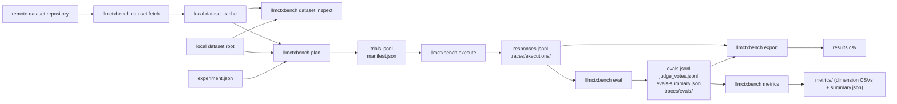

# Workflow

## Overview

LLMContextBench has two related flows:

1. dataset acquisition and inspection
2. benchmark lifecycle

Remote datasets are fetched explicitly before planning. Local-path datasets can skip the fetch
step and go straight to inspection or planning.


```mermaid
flowchart LR
    A["remote dataset repository"] --> B["llmctxbench dataset fetch"]
    B --> C["local dataset cache"]
    C --> D["llmctxbench dataset inspect"]
    E["local dataset root"] --> D
    C --> F["llmctxbench plan"]
    E --> F
    G["experiment.json"] --> F
    F --> H["trials.jsonl<br/>manifest.json"]
    H --> I["llmctxbench execute"]
    I --> J["responses.jsonl<br/>traces/executions/"]
    J --> K["llmctxbench eval"]
    J --> M["llmctxbench export"]
    K --> L["evals.jsonl<br/>judge_votes.jsonl<br/>evals-summary.json<br/>traces/evals/"]
    L --> M
    M --> N["results.csv"]
    L --> O["llmctxbench metrics"]
    O --> P["metrics/ (dimension CSVs + summary.json)"]
```

For `plan`, `execute`, and `eval`, adapter resolution happens once at the start of the phase before
that phase consumes dataset capabilities. The core then calls only the generic `DatasetPackage`
contract methods required by the phase.

`export`, `metrics`, and `status` are artifact-only commands. `export` requires
`responses.jsonl`; it optionally reads `evals.jsonl` and `judge_votes.jsonl` for evaluation and
judge metadata. It does not require `trials.jsonl` and cannot represent planned trials that have
no response. `metrics` requires `trials.jsonl` so it can include every planned trial, and treats
responses and evaluations as optional. These commands must succeed from their required artifacts
even when the dataset root or materialized path is no longer present.

## Planning

```bash
llmctxbench plan experiments/lattes_baseline_001.json --output outputs/lattes_baseline_001
```

Produces:

```text
manifest.json
trials.jsonl
```

## Execution

```bash
llmctxbench execute outputs/lattes_baseline_001/trials.jsonl
```

Produces:

```text
responses.jsonl
traces/executions/<trialId>.json
```

## Evaluation

```bash
llmctxbench eval outputs/lattes_baseline_001/responses.jsonl
```

Produces:

```text
evals.jsonl
judge_votes.jsonl
traces/evals/<trialId>.json
evals-summary.json
```

## Export

```bash
llmctxbench export outputs/lattes_baseline_001/evals.jsonl --to csv --output outputs/lattes_baseline_001/results.csv
```

Produces:

```text
results.csv
```

`llmctxbench export` requires `responses.jsonl` in the same artifact directory as the optional
`evals.jsonl` input. It emits one CSV row per response; planned trials without responses are not
represented. With `--id TRIAL_ID`, it prints detailed JSON for that response instead of writing
CSV. Evaluation and judge-vote artifacts are optional; when judge votes exist, export selects the
first non-error vote for judge metadata and justifications. It does not resolve the dataset,
materialize a dataset package, or call provider-backed execution/evaluation.

## Metrics

```bash
llmctxbench metrics outputs/lattes_baseline_001
```

Produces:

```text
metrics/trial_metrics.csv
metrics/aggregate_metrics.csv
metrics/dimension_summary.csv
metrics/summary.json
metrics/failure_cases.csv
metrics/metrics-manifest.json
metrics/dimensions/{effectiveness,efficiency,robustness,evaluation_reliability,observability}.csv
```

`llmctxbench metrics` is an artifact-only reader like `export` and `status`: it computes the
canonical metric dimensions from one or more existing run directories and does not resolve the
dataset or call providers. It requires `trials.jsonl`, includes every planned trial in
`trial_metrics.csv`, and supports planned-only, executed-only, and evaluated runs by leaving
missing response/evaluation-derived values empty. Its execution duration comes from
`responses.jsonl.metricsSummary.totalDurationMs`.

## Status

```bash
llmctxbench status outputs/lattes_baseline_001
llmctxbench status outputs/lattes_baseline_001 --by judge
```

`llmctxbench status` reports lifecycle progress from artifact counts and statuses. It does not inspect
or resolve the dataset.

## Local-path shortcut

If the experiment uses `dataset.root`, the workflow becomes:

```text
llmctxbench dataset inspect <dataset-root>
llmctxbench plan
llmctxbench execute
llmctxbench eval
llmctxbench export
llmctxbench metrics
```

No fetch step is required.

## Strategies

| Strategy | Description |
|---|---|
| `inline` | Inserts the selected context representation returned by `adapter.get_context(..., representation=trial.representation)` directly into the model input. |
| `local_function` | Exposes local Python functions while LLMContextBench controls the tool loop. |
| `local_mcp` | Exposes tools through a local MCP runtime while LLMContextBench controls the loop. |
| `remote_mcp` | Uses a remote MCP server; provider or remote integration may control part of the loop. |

For detailed runtime flows, see `dynamic.md`.

For physical deployment/topology see `deployment.md`.
